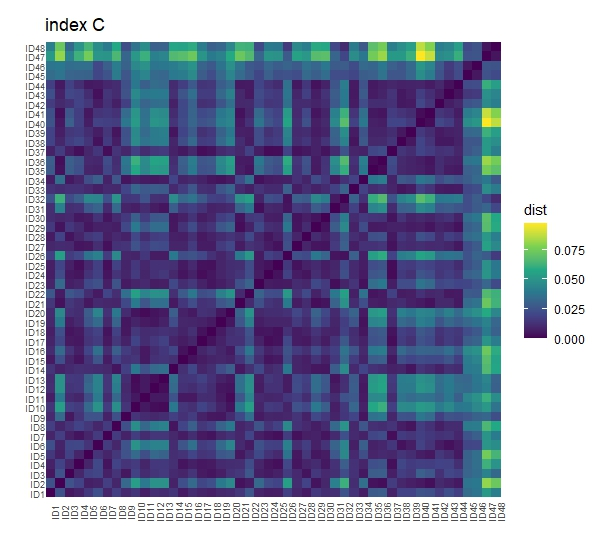

Using the Jensen–Shannon divergence to find dissimilarities between dissolved organic matter samples analyzed by high-resolution mass spectrometry
================
1/12/2022

**Authors:**

-   **Julian Merder:** : Carnegie Institution for Science, Department of
    Global Ecology, Panama Street, Stanford, CA 94305, USA

-   **Morimaru Kida:** : Soil Science Laboratory, Graduate School of
    Agricultural Science, Kobe University, 1-1 Rokkodai, Nada, Kobe,
    Hyogo 657-8501, Japan

-   **Thorsten Dittmar:** : Research Group for Marine Geochemistry
    (ICBM-MPI Bridging Group), Institute for Chemistry and Biology of
    the Marine Environment (ICBM), University of Oldenburg,
    Carl-von-Ossietzky-Str. 9-11, Oldenburg 26129, Germany & Helmholtz
    Institute for Functional Marine Biodiversity (HIFMB) at the
    University of Oldenburg, Oldenburg 26129, Germany
    
    
**If you use the JSD dissimilarity, please cite:** 

*Kida, M., Merder, J., Fujitake, N., Tanabe, Y., Hayashi, K., Kudoh, S., & Dittmar, T. (2023). **Determinants of Microbial-Derived Dissolved Organic Matter Diversity in Antarctic Lakes**. Environmental Science & Technology.
DOI: 10.1021/acs.est.3c00249*

**JSD\_DOM:**

The function JSD\_DOM in this repository can be used to calculate
dissimilarities between dissolved organic matter (DOM) samples. Commonly used dissimilarity metrics
such as the Bray-Curtis dissimilarity look at the compositional
dissimilarity between samples based on (relative) peak intensities or abundance of molecular formulae. In marine Geochemistry though
-and given the plethora of detected molecular formulae in a sample- it can sometimes be
more useful to instead compare molecular formula derived chemical
characteristics between samples. Imagine two samples that both have exactly the same predefined chemical compound class distributions but without a single shared molecular formula, because they are either from completely different locations or the DOM is produced by different species.  Chemically those samples are still similar to each other. Maybe even more so than to a sample that shares some molecular formulae with them but with different chemical compound class distributions. 

The Jensen-Shannon divergence (JSD) can fill this gap!
The JSD is the symmetric form of the
Kullback–Leibler divergence. It is designed to compare probability
distributions. In the discrete case, you can think about it as comparing
histograms between samples where each bin of a histogram corresponds to
the frequency of a predefined chemical compound class.

The classes need to be uniquely defined, so that a molecular formula
belongs only to one of them. Categorizations supported by this function
are:

**A:** “Aromatic”, “Highly.unsaturated”, “Unsaturated”, “Saturated”

**A1:**
“Aromatic.O\_rich”, “Aromatic.O\_poor”, “Highly.unsaturated.O\_rich”, “Highly.unsaturated.O\_poor”, “Unsaturated.O\_rich”, “Unsaturated.O\_poor”, “Saturated.O\_rich”, “Saturated.O\_poor”

**B:** “CH”, “CHO”, “CHON”, “CHOS”, “CHOP”, “CHONS”, “CHONP”, “CHONSP”

Further the JSD can be calculated on indices such as DBEAI defined as:

**C:** 1+C-0.5O-S-0.5*(H+N+P) calculated according to:

[Koch, B. P., and Dittmar, T. (2016) From mass to structure: an aromaticity index for high-resolution mass data of natural organic matter. Rapid Commun. Mass Spectrom., 30: 250. doi: 10.1002/rcm.7433]

**D:** The NOSC (Nominal oxidation state of carbon)

The function JSD is ideally taking an ICBM-OCEAN output (after molecular
formula attribution) as an input:

<https://uol.de/en/icbm/marine-geochemistry/research/icbm-ocean>

**The function takes the following arguments:**

**D:**

D= your ICBM-OCEAN data after molecular formula attribution

**method:**

Set method=“reference” for comparing samples against a chosen reference,
Set method=“matrix” for calculating a dissimilarity matrix

**index:**

Set index=“A”, index=“A1”, index=“B” or index=“C” for one of the options
above

**ref:**

Set ref to the column number of your reference sample e.g. ref=1 if
samples should be compared against the first sample in your data

**rename:**

Set rename=F to keep sample column names, set rename=T to rename to
“Sample X” where X is a consecutive sample ID matching the column order

**samplevector:**

Set samplevector=NULL if you are using ICBM-OCEAN data , otherwise this
should be a vector with the column names (or numbers) of the samples in the data.
If not using ICBM-OCEAN data and samplevector=NULL, your samples need the prefix "Sample", so the columns can be identified.

**sqrtJSD:**

Set sqrtJSD=F to calculate the JSD or set sqrt=T to squareroot the JSD.
The square root transformation has the nice property that the dissimilarity becomes metric also
often known as Jensen-Shannon distance.

A call to the function then is for example:

`#Example 1: comparison to a reference sample`

`A<-JSD_DOM(D=data, method="reference", index="B", rename=TRUE, sqrtJSD = TRUE)`

`A$plot`

`A$JSresults`

`#Example 2: sample x sample dissimilarity matrix`

`A<-JSD_DOM(D=data, method="matrix", index="C", rename=TRUE,samplevector = 70:117, sqrtJSD = TRUE)`

`A$plot`

`A$JSresults`

Use the JSD to check how similar your samples are:

\*further references: <https://www.pnas.org/content/106/8/2677>
<https://ieeexplore.ieee.org/document/1365067>
