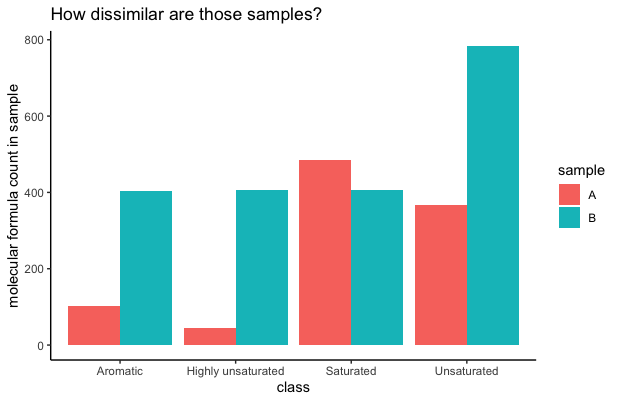

Using the Jensen–Shannon divergence to find dissimilarities between
FT-ICR-MS samples of Dissolved Organic Matter
================
1/12/2022

**Authors:**

-   **Julian Merder:** : Carnegie Institution for Science, Department of
    Global Ecology, Panama Street, Stanford, CA 94305, USA

-   **Morimaru Kida:** : Soil Science Laboratory, Graduate School of
    Agricultural Science, Kobe University, 1-1 Rokkodai, Nada, Kobe,
    Hyogo 657-8501, Japan

-   **Thorsten Dittmar:** : Research Group for Marine Geochemistry
    (ICBM-MPI Bridging Group), Institute for Chemistry and Biology of
    the Marine Environment (ICBM), University of Oldenburg,
    Carl-von-Ossietzky-Str. 9-11, Oldenburg 26129, Germany & Helmholtz
    Institute for Functional Marine Biodiversity (HIFMB) at the
    University of Oldenburg, Oldenburg 26129, Germany

**JSD\_DOM:**

The function JSD\_DOM in this repository can be used to calculate
dissimilarities between DOM samples. Commonly used dissimilarity metrics
such as the Bray-Curtis dissimilarity look at the compositional
dissimilarity between molecular formulae. In marine Geochemistry though
-and given the plethora of molecular formulae in a sample- it is often
more useful to compare molecular formula derived chemical
characteristics between samples instead. Imagine two samples that have
both 90% aromatic compounds but not a single shared molecular formula
because they are either from another location or produced by different
species. Chemically those samples are still similar to each other. Maybe
even more than to say a sample that shares some of those molecular
formula with them respectively.

The JSD can fill this gap. The JSD is the symmetric form of the
Kullback–Leibler divergence. It is designed to compare probability
distributions. In the discrete case, you can think about it as comparing
histograms between samples where each bin of a histogram corresponds to
the frequency of a predefined chemical compound class.

The classes need to be uniquely defined, so that a molecular formula
belongs only to one of them. Categorizations supported by this function
are:

**A:** “Aromatic”,“Highly.unsaturated”,“Unsaturated”,“Saturated”

**A1:**
“Aromatic.O\_rich”,“Aromatic.O\_poor”,“Highly.unsaturated.O\_rich”,“Highly.unsaturated.O\_poor”,“Unsaturated.O\_rich”,“Unsaturated.O\_poor”,“Saturated.O\_rich”,“Saturated.O\_poor”

**B:** “CH”,“CHO”,“CHON”,“CHOS”,“CHOP”,“CHONS”,“CHONP”,“CHONSP”

Further the JSD can be calculated on indices such as DBE defined as:

**C:** 1+C-0.5O-S-0.5(H+N+P)

The function JSD is ideally taking an ICBM-OCEAN output (after molecular
formula attribution) as input:

<https://uol.de/en/icbm/marine-geochemistry/research/icbm-ocean>

**The function takes the following arguments:**

**D:**

D= your ICBM OCEAN data after molecular formula attribution

**method:**

set method=“reference” for comparing samples against a chosen reference,
set set method=“matrix” for calculating a dissimilarity matrix

**index:**

set index=“A”, index=“A1”, index=“B”, index=“C” for one of the options
above

**ref:**

set ref to the column number of your reference sample e.g. ref=1 if
samples should be compared against the first sample in your data

**rename:**

set rename=F to keep sample column names, set rename=T to rename to
“Sample X” where x is a consecutive sample id matching the column order

**samplevector:**

set samplevector=NULL if you are using ICBM OCEAN data , otherwise this
should be a vector with the column names of the samples in the data

**sqrtJSD:**

set sqrtJSD=F to calculate the JSD , set sqrt=T to squareroot the JSD,
this has the nice property that the dissimilarity becomes metric also
often known as Jensen-Shannon distance.

A call to the function then is for example:

`#Example 1: compare to reference sample`

`A<-JSD_DOM(D=data,method="reference",index="B", rename=TRUE, sqrtJSD = TRUE)`

`A$plot`

`A$JSresults`

`#Example 2: sample x sample dissimilarity matrix`

`A<-JSD_DOM(D=data,method="matrix",index="C",rename=TRUE,sqrtJSD = TRUE)`

`A$plot`

`A$JSresults`

Use the JSD to check:

\*further references: <https://www.pnas.org/content/106/8/2677>
<https://ieeexplore.ieee.org/document/1365067>
